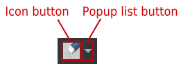
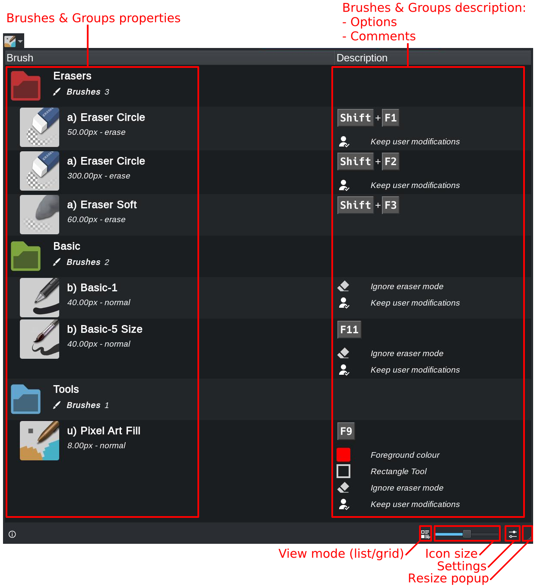
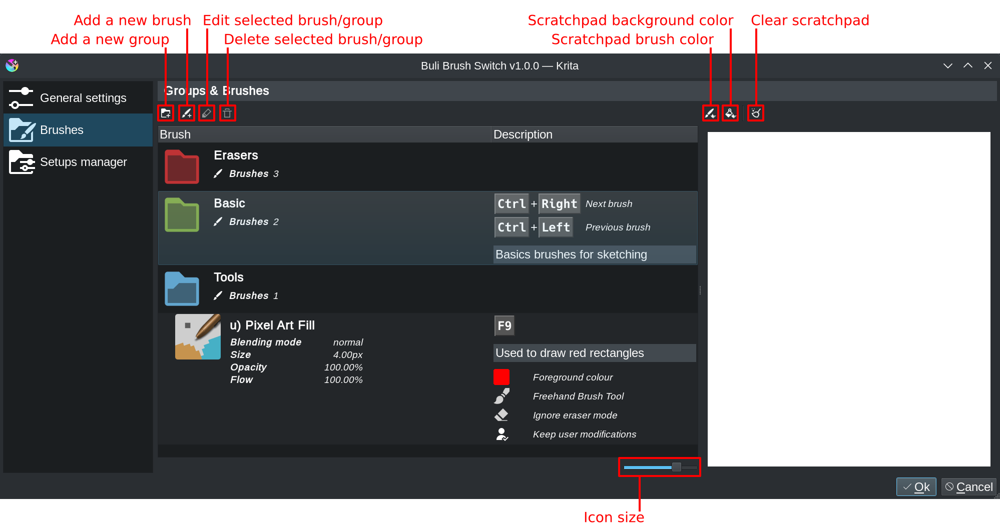

> # ***Documentation***
>
> A short documentation about *BuliBrushSwitch* plugin

# Running interface

The running interface is the default plugin UI.

## Toolbar button

When installed, plugin is automatically added in Krita's *Brushes and stuff* toolbar.

 Button is splitted in 2 parts:

| Button | Description |
| --- | --- |
| *Icon button* | Activate brush |
| *Popup list button* | Show a popup of brushes list |

## Popup brushes list

The popup brushes list is displayed when:
- Popup list button is clicked
- Shortcut "Show popup brushes list" is defined and used (can be useful in particular in "full canvas mode")

- Double-click on a group to expand/collapse it
- Click on a brush to activate brush
  > When a brush is activated, popup is automatically closed

## Brush activation

Activation of a brush from *BuliBrushSwitch* will change the default Krita's behavior about brushes.

| Case | Description |
| --- | --- |
| A brush is activated from plugin | Plugin take management brush - Krita's brush properties are overrided with the one defined by plugin |
| A brush is deactivated from plugin | Plugin leave management of brush  - Krita's brush properties are restored to previous values (the one set before plugin activate a brush)  |

> **Note**
> When plugin takes management of brush, toolbar button is highlighted:
> 

To **activate** a brush from plugin list, different possibilities:
- Open popup brush list and click on a brush to activate it
- If a shortcut has been defined for a brush, use shortcut to activate it

To **deactivate** a brush from plugin list:
- Open popup brush list, click on *the current active brush in list*
- If a shortcut has been defined for *the current active brush in list*, use shortcut to deactivate it
- If a shortcut has been defined for "*Deactivate current brush*" action, use shortcut to deactivate current brush (whatever the current brush is)
- Select any brush from Krita's brush preset selector

# Settings interface

The settings interface is the dedicated plugin UI to let user configure plugin and define brushes setups.

## General settings

The *General settings* page provide global settings

### Available default brush

Define which *default* brush is provided by button in Krita's toolbar:

| Checked option | Description |
| --- | --- |
| *First brush* | The brush will always be the first brush found in brushes list, whatever the last brush from list that has been selected - Clicking on it will then always activate the first brush found in brushes list |
| *Last selected* | The brush will always be the last selected from brushes list - Clicking on it will then re-activate the last brush that has been selected in list |

### Behaviour for brushes with specific values

Define default behaviour when paint tool/color is modified when using a brush with specific paint tool/color.

| Checked option | Description |
| --- | --- |
| *Ignore modified state* | For brushes with a specific paint tool and/or color defined, exiting plugin’s brush will always restore initial paint tool and/or color as they were before brush activation |
| *Keep modified state* | For brushes with specific paint tool and/or color, exiting plugin’s brush will: - If paint tool and/or color has been modified, keep last selected paint tool and/or color - If paint tool and/or color has NOT been modified, restore initial paint tool and/or color |

## Brushes

The *Brushes* page provide interface to manage and organize brushes.
> There's no limits to number of brushes in list, but at least ONE brush must be defined

Brushes can be organized in groups and sub-groups.
> There's no limits for groups/sub-groups deep

When added, a brush or group are added as last item of current parent group.
> Use Drag'n'Drop to move it at the right place if current one is not the expected one

### Scratchpad

A brush selected in list can be tested in the scratchpad.
> Selected brush properties (except tool) are applied

Scratchpad colors (foreground/background) can be changed if needed.

### Groups

Add a new group with ***Add group*** button.

Group editor provides following properties:

| Property | Description |
| --- | --- |
| *Group* ||
| Name | Name of group |
| Color | Folder color in brush list |
| *Shortcuts* ||
| Next brush | When defined, shortcut that will activate next brush in group - If current brush is the last one, will loop to the first one |
| Previous brush | When defined, shortcut that will activate previous brush in group - If current brush is the first one, will loop to the last one |
| Reset brush when exiting next/previous selection | By default, if you activate a brush outside the group, next time *Next/Previous brush* will be activated for group, plugin will continue from the last one that has been activated within group - When option is checked, it will always restart from first brush within group |
| *Description* | Optional description for group |

### Brushes

Add a new brush with ***Add brush*** button, and select brush to add from popup:

Brush editor provides following properties:

| Property | Description |
| --- | --- |
| *Brush* ||
| Blending mode | Define a specific blending mode to apply when brush is activated |
| Size | Define a specific size to apply when brush is activated |
| Opacity | Define a specific opacity to apply when brush is activated |
| Flow | Define a specific flow to apply when brush is activated |
| *Options / Brush options* ||
| Use a specific paint tool | When checked, the defined paint tool will be selected automatically when brush is activated |
| Use a specific color | When checked, defined color is automatically applied when brush is activated - Foreground color is mandatory - Background color is optional - Gradient color is optional |
| Preserve alpha | When checked, force brush to preserve alpha channel |
| Ignore tool opacity | When checked, allows to ignore tool opacity and force use of defined brush opacity whatever the tool is - This option is provided because Krita memorize opacity per tool (brush tool, line tool, rectangle tool, ...) rather than per brush: this means, when changing a tool, current defined opacity can be modified by new selected tool |
| *Options / Usage options* ||
| Shortcut | Shortcut associated to brush and used to activate/deactivate it - Can also be defined from Krita's usual shortcuts settings window |
| Keep user modifications | When checked, if brush properties are modified while painting, they're applied as new brush setup: - Blending mode - Size - Opacity - Flow - Paint tool *(only if option "Use specific paint tool is checked")* - Color *(only if option "Use specific color is checked")* - Preserve alpha When unchecked, modifications made to properties are not kept in brush configuration |
| Ignore eraser mode | When checked, Krita's *eraser mode* is deactivated for brush, you have to explicitly switch to an eraser |
| *Comments* | Optional description for brush |

## Setups manager

xxx
