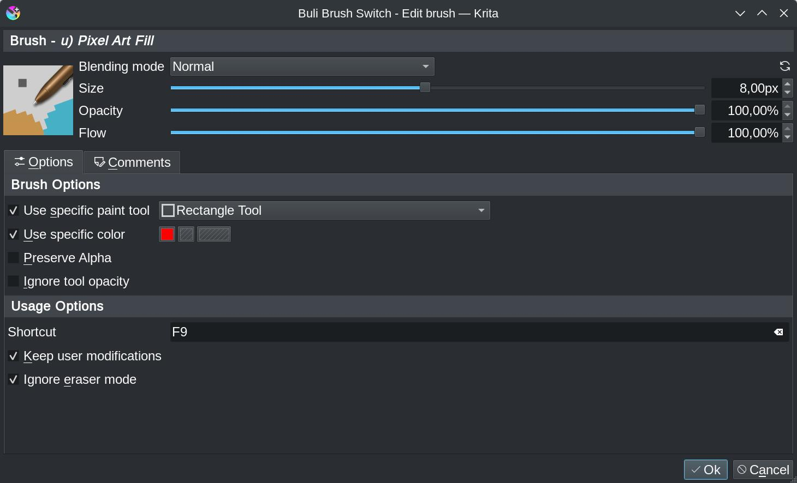
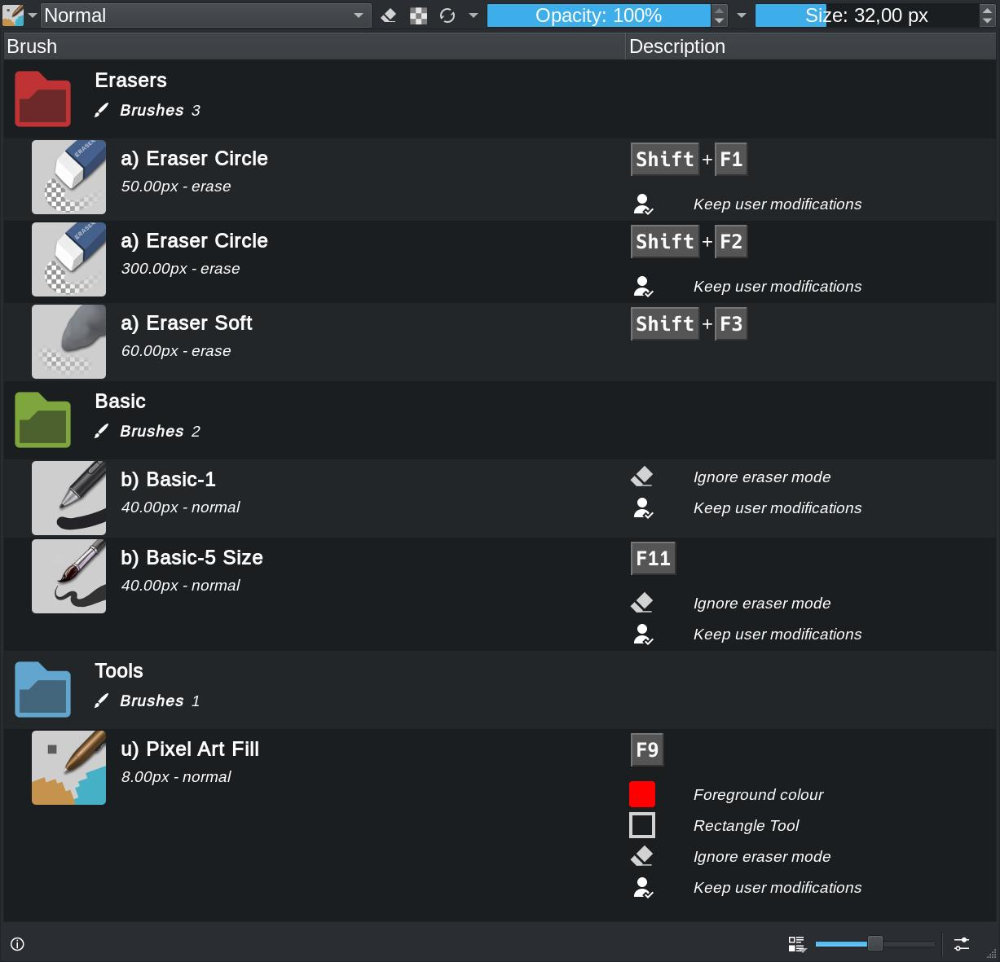

# Buli Brush Switch

A plugin for [Krita](https://krita.org).

## What is Buli Brush Switch?
*Buli Brush Switch* is a Python plugin made for [Krita](https://krita.org) (free professional and open-source painting program).

This plugin is similar to *Ten Brushes* and *Three Slots*: it allows to define shortcuts to activate brushes, but also provides additional features directly available from toolbar.

## Screenshots

*Settings brushes list*

*Setting a brush*

*Toolbar button + popup brush list*

## Functionalities

Main functionality for this plugin is to let possibility for user to quickly switch to preset brush through shortcuts (like *Ten Brushes* plugin)

Plugin allows:
- To manage an infinite number of brushes
- To access to brushes from popup list and/or through defined shortcuts
- To define properties (size, opacity, ...) per brush
- To put comment on brushes

Shortcuts for brushes can be managed directly from plugin or from default Krita's user interface for shorcuts; in this case, actions are named taking in account brushes name & comments.

> Read short documentation section below for more detailed informations

## Download, Install & Execute

### Download
+ **[ZIP ARCHIVE - v0.1.1b](https://github.com/Grum999/BuliBrushSwitch/releases/download/0.1.1b/bulibrushswitch.zip)**
+ **[SOURCE](https://github.com/Grum999/BuliBrushSwitch)**

### Installation

Plugin installation in [Krita](https://krita.org) is not intuitive and needs some manipulation:

1. Open [Krita](https://krita.org) and go to **Tools** -> **Scripts** -> **Import Python Plugins...** and select the **bulibrushswitch.zip** archive and let the software handle it.
2. Restart [Krita](https://krita.org)
3. To enable *Buli Brush Switch* go to **Settings** -> **Configure Krita...** -> **Python Plugin Manager** and click the checkbox to the left of the field that says **Buli Brush Switch**.
4. Restart [Krita](https://krita.org)

### Execute

Once installed, you should have a new button in toolbar, near the Krita's *Choose brush preset* button:

### Tested platforms

Plugin requires at least Krita 5
It has been tested with Krita 5.0.0-beta2 (appimage) on Linux Debian 10.

- Not yet tested on another OS.
- Not yet tested on Krita 5.1

---

## (Short) Documentation

### Toolbar button

Button is splitted in 2 parts:

| Button | Description |
| --- | --- |
| *Icon button* | Direct access to activate the brush  |
| *Popup list button* | Show popup brushes list |

### Popup brushes list

The popup brushes list is displayed when:
- Popup list button is clicked
- Shortcut "Show popup brushes list" is defined and used (can be useful in particular in "full canvas mode")

### Settings

Plugin allows to define from 1 to *N* brushes in a dedicated list, there's no limits to number of brushes in list.

#### Settings: Button selection mode

The option for *Button selection mode* in brush list settings window allows to define how the icon button is used.

| Checked option | Description |
| --- | --- |
| *First from list* | - The icon in toolbar will always be the first brush defined in list, whatever the last brush from list that has been selected - Clicking on icon button will then always activate the first brush in list |
| *Last selected* | - The icon in toolbar will always be the one from last selected brush in list - Clicking on icon button will then re-activate the last brush that has been selected in list |

#### Settings: Brushes list

Brushes in list can be:
- Added
- Edited
- Removed
- Re-ordered

A scratchpad allows to tests brushes directly from brushes list settings window.

#### Settings: Brush options

When created or updated,

Each brush can be configured with some options:

| Option | Description |
| --- | --- |
| *Keep user modification* | When checked, modified brush properties are kept for next time: - Blending mode - Size - Opacity - Flow - Color *(only if option "Use specific color is checked")* When unchecked, modifications made to properties are not kept in brush configuration |
| *Ignore eraser mode** | When checked, Krita's *eraser mode* is deactivated for brush, you have to explicitly switch to an eraser |
| *Use specific color** | When checked, defined color is automatically applied when brush is activated |
| *Shortcut* | Shortcut to activate/deactivate a brush can be defined from here (or from Krita's usual shortcuts settings window) |
| *Comments* | Free rich text comment can be added on a brush First comment line is used to identify easily brushes in Krita's usual shortcuts settings window |

> **Options not available for eraser brushes*

### Brush selection

Selecting a brush from plugin will "change" the default Krita's behavior about brushes.

| Case | Description |
| --- | --- |
| *A brush is selected from plugin list* | - Plugin take management of brushes (brush properties from plugin overrides Krita's brush rules) - Brush properties are reset with the one defined in plugin |
| *A brush is unselected from plugin list* | - Plugin leave management of brush (Krita's normal behaviour for brushes is applied)  - Brush & properties that were defined before plugin took management are restored to their values |

> **Note:**
> When plugin takes management of brush, toolbar button is highlighted:
> 

To **select** a brush from plugin list, different possibilities:
- Open popup brush list, and click on desired brush to activate it
- If a shortcut has been defined for desired brush, use shortcut to activate it

To **unselect** a brush from plugin list:
- Open popup brush list, click on *the current active brush in list*
- If a shortcut has been defined for *the current active brush in list*, use shortcut to deactivate it
- If a shortcut has been defined for "*Deactivate current brush*" action, use shortcut to deactivate current brush (whatever the current brush is)
- Select any brush from Krita's brush preset selector

---

## Plugin's life

### What's new?

_[2021-12-02] Version 0.1.1b_ *[Show detailed release content](https://github.com/Grum999/BuliBrushSwitch/blob/main/releases-notes/RELEASE-0.1.1b.md)*
- Add missing `.action` file on installation
- Fix invalid default brush definition from settings when no configuration files exists
- On Windows, fix main Brushes list window staying over Brush setting window

_[2021-12-01] Version 0.1.0b_ *[Show detailed release content](https://github.com/Grum999/BuliBrushSwitch/blob/main/releases-notes/RELEASE-0.1.0b.md)*
- First implemented/released version!

### Bugs

Known bug on shortcut widget, all keystrokes are not recognized.
And probably some other I didn't saw.
The shortcut configuration has been a little bit tweaked to let the plugin being able to manage an indeterminate number of brushes, so please take care about potential bugs here.

Please consider the plugin is still in beta version!

### What’s next?

Some ideas to implement:
- Add an option at brush level to let possibility to switch automatically to freehand brush tool (or any other?) when brush is selected
- Replace option "Ignore eraser mode" at brush level to let the possibility to define a specific brush to use for "eraser mode"
- In canvas only mode, display popup list centered on cursor position
- Some cosmetics improvements (brush list, toolbar button)
- Allows to configure brush properties (blending mode, size, opacity, flow) from brush setting dialog box

## License

### *Buli Brush Switch* is released under the GNU General Public License (version 3 or any later version).

*Buli Brush Switch* is free software: you can redistribute it and/or modify it under the terms of the GNU General Public License as published by the Free Software Foundation, either version 3 of the License, or any later version.

*Buli Brush Switch* is distributed in the hope that it will be useful, but WITHOUT ANY WARRANTY; without even the implied warranty of MERCHANTABILITY or FITNESS FOR A PARTICULAR PURPOSE. See the GNU General Public License for more details.

You should receive a copy of the GNU General Public License along with *Buli Brush Switch*. If not, see <https://www.gnu.org/licenses/>.

Long story short: you're free to download, modify as well as redistribute *Buli Brush Switch* as long as this ability is preserved and you give contributors proper credit. This is the same license under which Krita is released, ensuring compatibility between the two.
