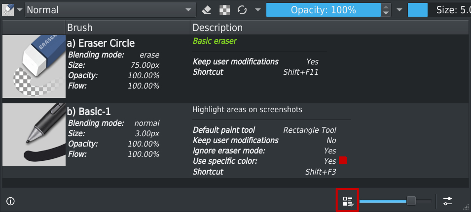
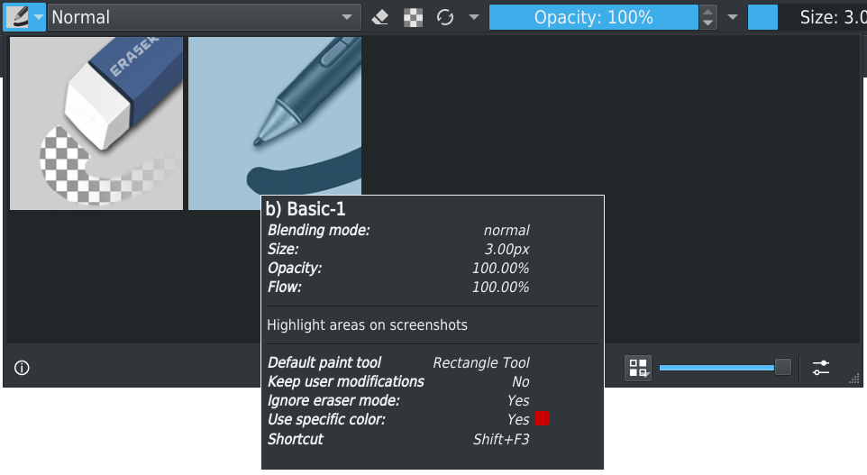
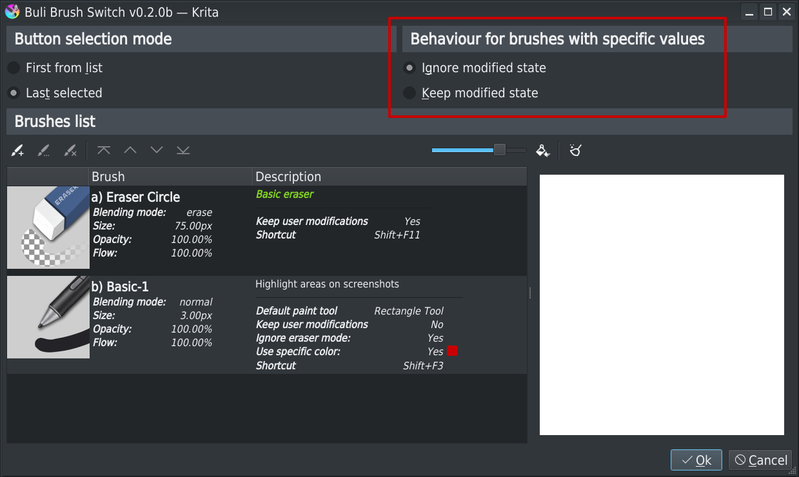
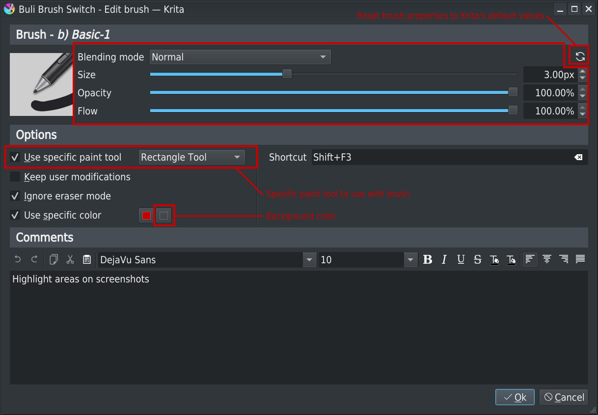
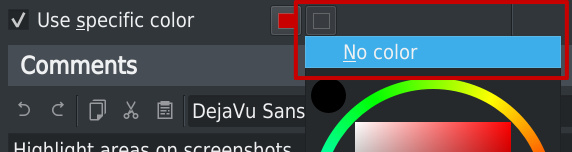

# Buli Brush Switch :: Release 0.2.0b [2021-12-10]

# Improve *Popup brushes list*

## Popup position

When popup brushes list is displayed, ensure the popup is entirely visible in current screen.

In canvas only mode, display popup brush list is now centered under cursor position.

## Popup style & tooltip

The popup brushes list can be displayed as a list of brushes, with detailed informations, or as an icons grid.

Detailed tooltip on brushes allows to display informations if not available (small icon size or icons grid mode).

*Detailed list style*

> Click on "Brushes view mode" button to switch between visualisation style

*Icons grid list style*

> Tooltip on brush icon display detailed informations

# Improve *Brushes settings*

## Default behaviour with modified paint tool/color for brush with specific paint tool/color

An option to let user choose default behaviour when paint tool/color is modified when using a brush with specific paint tool/color:
- **Ignore modified state**
  *For brushes with specific paint tool and/or color, exiting plugin’s brush will always restore initial paint tool and/or color*

- **Keep modified state**
  *For brushes with specific paint tool and/or color, exiting plugin’s brush will:*
  *- If paint tool and/or color has been modified, keep last selected paint tool and/or color*
  *- If paint tool and/or color has NOT been modified, restore initial paint tool and/or color*

> Choosen option is applied for all brushes

## Define brush properties from brush settings

The brush settings window allows to modify brush properties:
- Blending mode
- Size
- Opacity
- Flow

A button allows to reset brush properties to Krita's default settings values.

## Specific paint tool

It's possible to define a specific **paint tool** to activate when brush is selected.

## Specific background color  

When a specific color is defined, it's now possible to also define a background color to apply when brush is selected.

To not modify Krita's background color, just set value to **No color**.

> **Note:** It's not possible to set a background color without a foreground color: when option is activated, foreground is mandatory, background is optional

# Fixed bugs

## Error when selecting brush from *Popup brushes list*

When no canvas was available, selecting a brush was generating a script error message.

Fixed: selecting a brush when no canvas is available is ignored.

## Error on Krita's exit  

Closing Krita when plugin configuration was modified but not saved was generating a script error message.
There was also some situation where plugin configuration was not saved because situation (configuration not saved) was not detected.

Fixed: saving configuration is now made properly; also fixed case where situation was not detected.

## Shortcut lost on tool selection

When a tool was selected, defined shortcuts (through plugin interface) were lost.
There was also some miscellaneous situations were shortcuts configurations were lost from settings dialog.

Fixed: shortcut aren't lost anymore.

## Non modal settings window

Brushes list settings window wasn't modal and it was possible to modify configuration, use Krita's and plugin, and get dirty thing in this case.

Fixed: brushes list settings window is now modal window.

## Krita's brush properties lost

In some specific use, Krita's brush properties were override by plugin brush properties.

Fixed: when exiting selected plugin brush, Krita's brush properties are properly restored

## Invalid selected brush

When button selection mode was set to "*Last selected*" and if there was more than one brush settings for the same brush name (example: 2 different settings for brush **a) Basic-1**) the first brush found in list was always selected.

Fixed: the right brush settings is always selected, even if there's more than one definition with the same brush name.

## Difference according to method used to exit selected plugin brush

When exiting selected plugin brush from:
- Toolbar button click
- Selecting another brush preset in Krita's brush presets list
- Shortcut

The behaviour about how initial color was restored was not the same.

Fixed: whatever the method used to activate/deactivate a plugin's brush, the behaviour is the same.

## Missing icon on *Brushes list settings*

The *Clear scratchpad* icon was missing on windows.

Fixed: use right icon whatever the OS on which plugin is running
