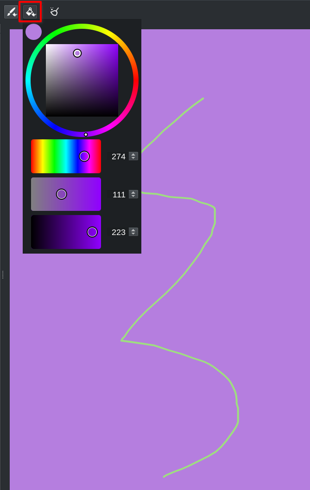

# Buli Brush Switch :: Release 1.0.0 [2022-xx-xx]

# Krita Interface

## Improve toolbar button
[Feature request #5](https://github.com/Grum999/BuliBrushSwitch/issues/5)

Review button in Krita toolbar to let it being rendered exactly like the *Brush Preset Chooser* button is.

- Left button: Krita *Brush Preset Chooser*
- Right button: Buli Brush Switch button

*(Top: Linux / Bottom: Windows)*

# Settings Interface

## Let user choose scratchpad background color
[Feature request #4](https://github.com/Grum999/BuliBrushSwitch/issues/4)

An additional color button menu has been added; there's now:
    - One button to choose brush color in scratchpad
    - One button to choose background color for scratchpad

## Color button when *No color*
[Feature request #6](https://github.com/Grum999/BuliBrushSwitch/issues/6)

Represent the **No color** choice for background color with hatched pattern

# Fix bugs

## Settings Interface - *Ignore eraser mode option*
[Bug #10](https://github.com/Grum999/BuliBrushSwitch/issues/10)

Option *Ignore eraser mode* was not taken in account (always checked)

Now problem is fixed

## Main Interface - *Crash when brushes from disabled bundles are referenced*
[Bug #1](https://github.com/Grum999/BuliBrushSwitch/issues/1)

When a brush is linked to a deactivated bundle, brush thumbnail can't be returned and then generate python exception

To avoid this, now display a warning icon:

## Main Interface - *Lag/Freeze when changing brush*
[Bug #2](https://github.com/Grum999/BuliBrushSwitch/issues/2)

There was a lag (from ~0.28s to ~1.00s) when changing brush from Buli brush switch
Switch time was different according to tool.

Now problem is fixed (~0.01s to switch)
