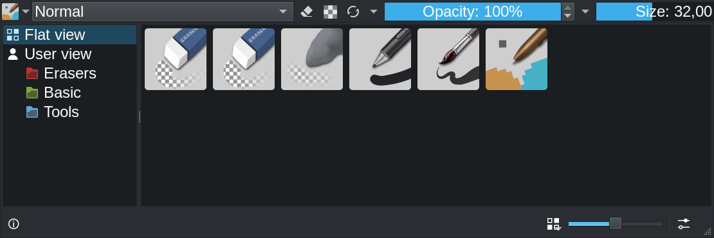
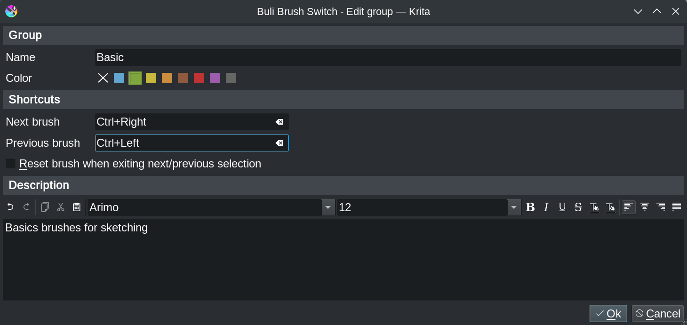
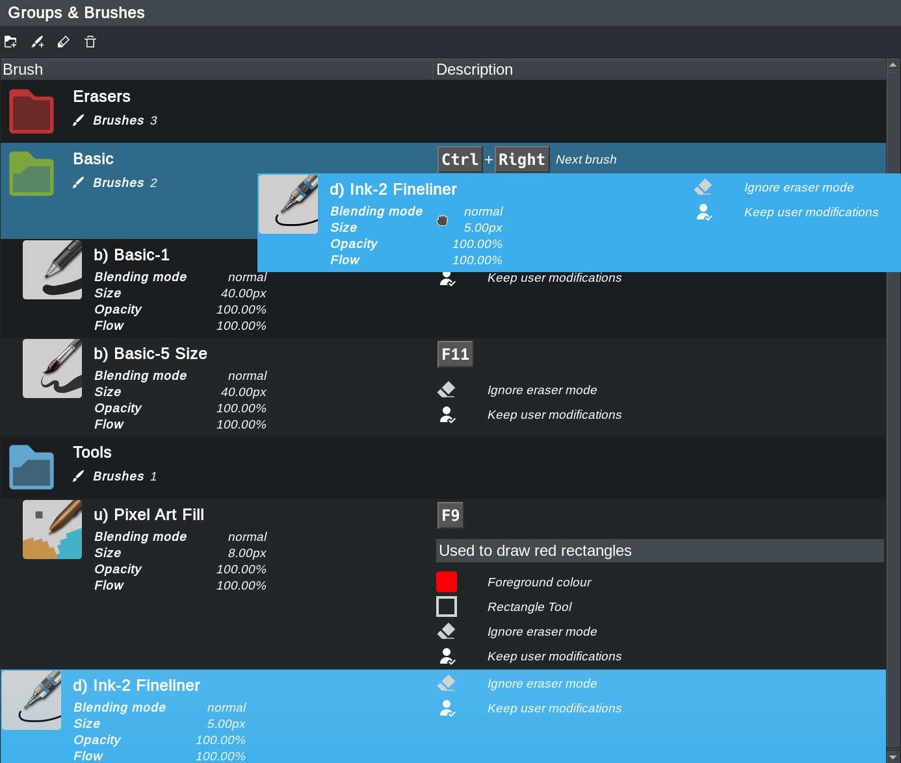
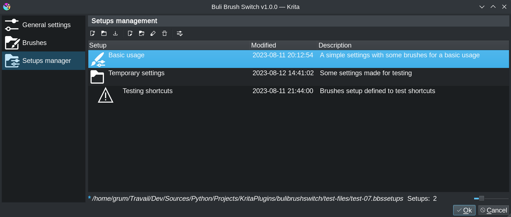

# Buli Brush Switch :: Release 1.0.0 [2023-xx-xx]

# Krita Interface

## Improve toolbar button
[Feature request #5](https://github.com/Grum999/BuliBrushSwitch/issues/5)

Review button in Krita toolbar to let it being rendered exactly like the *Brush Preset Chooser* button is.

- Left button: Krita *Brush Preset Chooser*
- Right button: Buli Brush Switch button

*(Top: Linux / Bottom: Windows)*

# Main Interface

## Icon view
Icon view from main popup interface has been reviewed to take in account groups management:
    - Flat view
    - User view

# Main settings

## Redesign
With new Setups manager, user interface has been redesigned.

## Brushes - Improve layout for brushes informations
[Feature request #15](https://github.com/Grum999/BuliBrushSwitch/issues/15)

Layout and informations provided are now more readable:
    - Only display active options
    - Reduce text and use icons

## Brushes - Organize brushes within groups
[Feature request #9](https://github.com/Grum999/BuliBrushSwitch/issues/9)

Brushes can now be organized withins groups
Group editor provides:
    - Group color
    - Shorcuts to activate previous/next brush in group
    - Editor to write a description

## Brushes - Re-organize brushes & and groups with Drag'n'Drop
[Feature request #3](https://github.com/Grum999/BuliBrushSwitch/issues/3)

Brushes and groups can be re-organized with Drag'n'Drop

## Brushes - Let user choose scratchpad background color
[Feature request #4](https://github.com/Grum999/BuliBrushSwitch/issues/4)

An additional color button menu has been added; there's now:
    - One button to choose brush color in scratchpad
    - One button to choose background color for scratchpad

## Setups manager
[Feature request #16](https://github.com/Grum999/BuliBrushSwitch/issues/16)

The Setups manager allows to create and organize differents *BuliBrushSwitch* configuration.

Instead of having a unique big configuration with a lot of brushes, users can create different configuration according to their need.
Also, configuration in Setups manager can be exported/imported:
    - For backup
    - If working on multiple computer

# Brushes settings

## Redesign
With new options, user interface has been redesigned to be less messy.

## Color button when *No color*
[Feature request #6](https://github.com/Grum999/BuliBrushSwitch/issues/6)

Represent the **No color** choice for background color with hatched pattern

## Additional brushes options

### Take in account the preserve Alpha option
[Feature request #7](https://github.com/Grum999/BuliBrushSwitch/issues/7)
Allows brush to force use of *preserve Alpha* option

### Gradient color
[Feature request #8](https://github.com/Grum999/BuliBrushSwitch/issues/8)
Some brushes can use a gradient as source color, so let user define a specific gradient for brush, like it's already made for foreground and background colors.

### Ignore tool opacity
[Feature request #14](https://github.com/Grum999/BuliBrushSwitch/issues/14)
Krita memorize opacity per tool (brush tool, line tool, rectangle tool, ...) rather than per brush.
This means, when changing a tool, current defined opacity can be modified by new selected tool.

This option allows to ignore tool opacity and force use of defined brush opacity whatever the tool is.

# Fix bugs

## Brush Settings - *Ignore eraser mode option*
[Bug #10](https://github.com/Grum999/BuliBrushSwitch/issues/10)

Option *Ignore eraser mode* was not taken in account (always checked)

Now problem is fixed

## Brush Settings - **Keep user modifications*
[Bug #11](https://github.com/Grum999/BuliBrushSwitch/issues/11)

Option *Keep user modifications* was not taken properly in account when brush was deactivated

Now problem is fixed

## Main Interface - *Crash when brushes from disabled bundles are referenced*
[Bug #1](https://github.com/Grum999/BuliBrushSwitch/issues/1)

When a brush is linked to a deactivated bundle, brush thumbnail can't be returned and then generate python exception

To avoid this, now display a warning icon:

## Main Interface - *Lag/Freeze when changing brush*
[Bug #2](https://github.com/Grum999/BuliBrushSwitch/issues/2)

There was a lag (from ~0.28s to ~1.00s) when changing brush from Buli brush switch
Switch time was different according to tool.

Now problem is fixed (~0.01s to switch)
