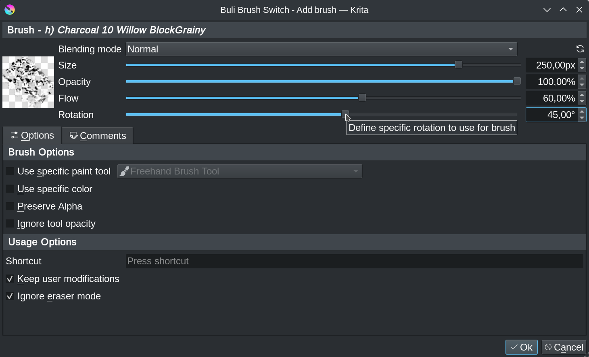

# Buli Brush Switch :: Release 1.1.0 [2023-12-10]

# Brushes settings

## Brush rotation
[Feature request #20](https://github.com/Grum999/BuliBrushSwitch/issues/20)

Let user define a specific brush rotation
> Brush rotation is available only for brushes for which a predefined brush tip is defined

